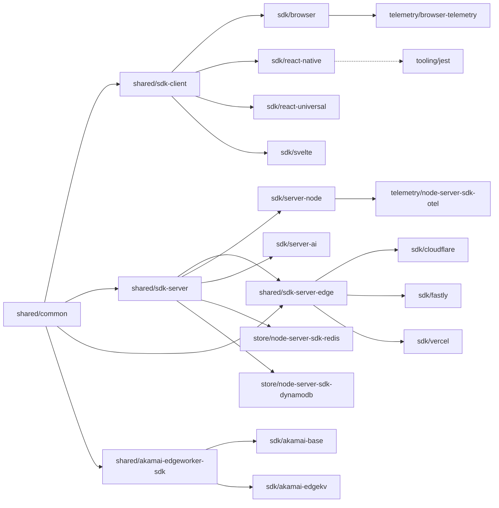

# Contributing to the monorepo for JavaScript SDKs

LaunchDarkly has published an [SDK contributor's guide](https://docs.launchdarkly.com/sdk/concepts/contributors-guide) that provides a detailed explanation of how our SDKs work. See below for additional information on how to contribute to this SDK.

## Submitting bug reports and feature requests

The LaunchDarkly SDK team monitors the [issue tracker](https://github.com/launchdarkly/js-core/issues?q=is%3Aissue+is%3Aopen+sort%3Aupdated-desc) in the SDK repository. Bug reports and feature requests specific to this SDK should be filed in this issue tracker. The SDK team will respond to all newly filed issues within two business days.

## Submitting pull requests

We encourage pull requests and other contributions from the community. Before submitting pull requests, ensure that all temporary or unintended code is removed. Don't worry about adding reviewers to the pull request; the LaunchDarkly SDK team will add themselves. The SDK team will acknowledge all pull requests within two business days.

## Build instructions

### Prerequisites

A node environment of version 16 and npm or yarn are required to develop in this repository.

This monorepo may contain projects that are not suitable for execution using node, and those
projects will have specific environment prerequisites.

### Setup

To install project dependencies, from the project root directory:

```
yarn
```

### Build

To build all projects, from the root directory:

```
yarn build
```

To build a single project and all of its dependencies:
```
yarn workspaces foreach -pR --topological-dev --from '@launchdarkly/js-client-sdk' run build
```
Replacing `@launchdarkly/js-client-sdk` with the specific package you want to build.

Running `yarn build` in an individual package will build that package, but will not rebuild any dependencies.

### Testing

Unit tests should be implemented in a `__tests__` folder in the root of the package. The directory structure inside of `__tests__` should mirror that of the source directory.

Each package has its own testing requirements and tests should be only ran for single projects.

To run the SDK contract test suite (see [`contract-tests/README.md`](./contract-tests/README.md)):
The SDK contract test suite will run the Node.js Server version of the SDK.

```bash
yarn run contract-tests
```

Tests cases should be written using `it` and should read as a sentence including the `it`:
```TypeScript
it('does not load flags prior to start', async () => {/* test code */}
```

Describe blocks should be used for common setup for a series of tests:
```TypeScript
describe('given a mock filesystem and memory feature store', { /* tests */})
```

These then combined to create an understandable test name:
`given a mock filesystem and memory feature store > it does not load flags prior to start`

## Development Guidelines

These are a series of recommendations for developing code in this repository. Not all existing code will comply
with these guidelines, but new code should unless there are specific reasons not to.

While we develop code in TypeScript we generally want to aim for the compiled JavaScript to not be substantially different than if it had been written as JavaScript.

### Avoid using TypeScript enumerations. Instead use unions of strings.

Bad:
```TypeScript
export enum ValueType {
  Bool = 'bool',
  Int = 'int',
  Double = 'double',
  String = 'string',
  Any = 'any',
}
```

Good:
```TypeScript
export type ValueType = 'bool' | 'int' | 'double' | 'string' | 'any'
```

While we are using TypeScript not all consumers of our code will be. Using a TypeScript enum from JavaScript is not very ergonomic.
Additionally the code size associated with enums is going to be larger. The enum actually generates code, where the union provides type safety, but has no impact on the generated code.

### Prefer interfaces over classes when reasonable, especially if publicly exposed.

Bad:
```TypeScript
class MyData {
  public mutable: string;
  constructor(private readonly value: string private readonly another: string);
}
```

Good:
```TypeScript
interface MyData {
  readonly value: string;
  readonly another: string;
  mutable: string;
}

function createMyData(value: string, another: string, mutable: string): MyData {
  return {
    value,
    another,
    mutable
  }
}
```

There are several potential problems using classes and some of them may be unexpected.

Classes produce JavaScript code while interfaces only represent contracts and don't exist in the generated JavaScript. In client-side applications keeping size to a minimum is very important.

The minification of associated functions is also another major difference. Functions that are not exported from the package can have their names minified. Methods that are part of a class are generally not minified.

A number of classes are present in the SDKs that cannot be removed without a major version. In order to reduce the size of these classes we have added support for minification of any member that starts with an underscore.

Another thing to remember is that the private and readonly only really affect TypeScript. Using JavaScript you can still access and mutate. Our minification of private members starting with an underscore also helps prevent unintentional usage from JavaScript.

## Repo Organization

The below diagram shows the dependency relationships between the various packages in the LaunchDarkly JavaScript SDKs monorepo.

Packages on the left are shared packages that should be technology agnostic. As you progress to the right, packages are more specific to a technology or implementation.



There are a number of categories of packages in the monorepo:

1. **Shared packages** (pink): Common code shared across multiple SDKs
   - `shared/common`:Common code which is intended for use by any SDK type.
   - `shared/sdk-client`: Common code for client-side SDKs.
   - `shared/sdk-server`: Common code for server-side SDKs
   - `shared/sdk-server-edge`: Common code for edge SDKs
   - `shared/akamai-edgeworker-sdk`: Common code for Akamai edge worker SDKs

2. **SDK packages** (blue): Actual SDK implementations for different platforms
   - Browser, React Native, Server Node, Cloudflare, Fastly, Vercel, Akamai, etc.

3. **Store packages** (green): Persistent storage implementations
   - Redis and DynamoDB implementations

4. **Telemetry packages** (purple): Monitoring and telemetry integrations
   - OpenTelemetry for Node.js and browser telemetry

5. **Tooling packages** (red): Development and testing tools
   - Jest testing utilities

### Depenencies

In general dependencies should be avoided unless they are absolutely necessary. For each dependency several considerations should be made:

- Size: Each dependency will increase the final bundle size. This is important for the browser SDK where bundle size impacts load time and costs.
- Maintenance: Dependencies can become unmaintained or deprecated over time. This requires that we routinely check dependencies and find replacements if they have become unmaintained.
- Security: Dependencies can have a large surface area of security vulnerabilities. It is rare we would fully utlize a dependency, and as such vulnerabilities often do not apply, but we still need to patch and provide updates.
- Compatibility: Each dependency will need to be compatible with the supported platforms it impacts. At any given point it isn't certain the potential platforms that could be impacted over time. For instance something may work in every current edge environment, but may not be compatible with a future edge environment.
- Conflicts: Dependencies can introduce conflicts with other dependencies in application code.

We only want to use dependencies for functionality with highly-specified behavior, which are widely used, maintained, and have a large community.

It is most important to avoid dependencies in the common package, sdk-client, and sdk-server packages.

Individual SDK packages have a known execution environment and vetting a dependency is less complex, and some SDKs have specific platform dependencies that must be included. For example the edge SDKs must use their provider's edge store, and may require dependencies to do so.