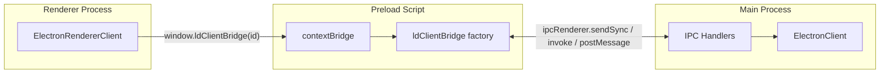

# IPC Bridge: Main Process and Renderer

This document describes how the LaunchDarkly Electron SDK uses Inter-Process Communication (IPC) between the main process and browser windows so the renderer can interact with the LaunchDarkly client. It also explains why this architecture was chosen.

## Overview and Architecture

The real LaunchDarkly client (streaming connection, flag storage, identify, and events) lives **only in the main process**. The renderer never holds SDK state or talks to LaunchDarkly directly. All renderer interactions go through a bridge that forwards calls over IPC to the main process.

The design has three layers:

- **Main process**: [ElectronClient](src/ElectronClient.ts) is created via `initInMain(sdkKey, options)`. The first argument is the SDK key: by default the SDK uses a **mobile key**; for legacy client-side ID usage pass `useClientSideId: true` in options. When `enableIPC: true` (the default), it registers IPC handlers so the renderer can call through to the real client.
  > NOTE: that when `enableIPC` is set to `false`, no IPC handlers will be registered in browser windows. This means
  > that only the main process is able to use the LaunchDarkly SDK.

- **Preload (bridge)**: [bridge/index.ts](src/bridge/index.ts) runs in the preload script. It builds an object that forwards each LD client method over IPC and exposes it via `contextBridge.exposeInMainWorld('ldClientBridge', ldClientBridge)`.
- **Renderer**: [ElectronRendererClient](src/renderer/ElectronRendererClient.ts) is created via `initInRenderer(sdkKey)` from `@launchdarkly/electron-client-sdk/renderer`. The value must match the key passed to `initInMain`. The renderer obtains the bridge from `window.ldClientBridge(sdkKey)` and delegates every call to the bridge (and thus to the main process over IPC).

> See [electron docs](https://www.electronjs.org/docs/latest/tutorial/ipc) for more information.

## IPC Channel Naming and Registration

**Channel pattern**: All channels use the form `ld:${sdkKey}:${methodName}`. Examples: `ld:my-mobile-key:variation`, `ld:my-mobile-key:identify`. This namespaces by the SDK key so multiple LD clients could coexist (e.g. different environments).

**Where handlers are registered**: Handlers are registered only in the main process, inside `ElectronClient._registerInMain()`, and only when the client is created with `enableIPC: true`. The preload script does not register any handlers; it only sends or invokes on these channels.

**Event handlers (addEventHandler / removeEventHandler)**: Renderer `client.on()` and `client.off()` are implemented via the bridge’s `addEventHandler` and `removeEventHandler`. For `addEventHandler`, the renderer creates a `MessageChannel`, transfers one port to the main process via `postMessage`, and the main process registers a listener on the real client that forwards event args over that port back to the renderer. For `removeEventHandler`, the renderer sends `eventName` and `callbackId` synchronously; the main process unregisters the listener, closes the port, and returns success or failure.

**Bridge registration**: The bridge is exposed as a **side effect on import**. The application’s preload script imports `@launchdarkly/electron-client-sdk/bridge`. That module, when loaded, calls `contextBridge.exposeInMainWorld('ldClientBridge', ldClientBridge)`. There is no explicit “register” call. To enable the bridge, the app must (1) import the bridge in the preload script and (2) set that preload script in `webPreferences.preload` when creating the `BrowserWindow`.

## Security and Context Isolation

**contextBridge**: The renderer never receives a reference to `ipcRenderer` or other Node/Electron APIs. Only the explicitly exposed `ldClientBridge(sdkKey)` function is available in the renderer, and that function returns an object that exposes only the LD client API (variations, identify, events, etc.). There is no `require`, no `process`, and no raw IPC in the renderer.

**Preload as the only bridge**: All IPC is initiated from the preload script. The bridge module is the single place that translates between renderer calls and IPC; this keeps the allowed surface small and auditable.
