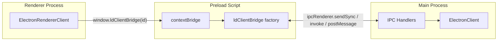

# IPC Bridge: Main Process and Renderer

This document describes how the LaunchDarkly Electron SDK uses Inter-Process Communication (IPC) between the main process and browser windows so the renderer can interact with the LaunchDarkly client. It also explains why this architecture was chosen.

## Overview and Architecture

The real LaunchDarkly client (streaming connection, flag storage, identify, and events) lives **only in the main process**. The renderer never holds SDK state or talks to LaunchDarkly directly. All renderer interactions go through a bridge that forwards calls over IPC to the main process.

The design has three layers:

- **Main process**: [ElectronClient](src/ElectronClient.ts) is created via `createClient(credential, initialContext, options)`. The first argument is the credential (mobile key or client-side ID when `useClientSideId: true`). When `enableIPC: true` (the default), it registers IPC handlers so the renderer can call through to the real client.
  > NOTE: When `enableIPC` is set to `false`, no IPC handlers will be registered in browser windows. This means
  > that only the main process is able to use the LaunchDarkly SDK.

- **Preload (bridge)**: [bridge/index.ts](src/bridge/index.ts) runs in the preload script. It builds an object that forwards each LD client method over IPC and exposes it via `contextBridge.exposeInMainWorld('ldClientBridge', ldClientBridge)`.
- **Renderer**: [ElectronRendererClient](src/renderer/ElectronRendererClient.ts) is created via `createRendererClient(clientSideId)` from `@launchdarkly/electron-client-sdk/renderer`, which returns an `ElectronRendererClient` instance. The `clientSideId` must match the credential passed to `createClient` in the main process. The renderer obtains the bridge from `window.ldClientBridge(clientSideId)` and delegates every call to the bridge (and thus to the main process over IPC).

> See [electron docs](https://www.electronjs.org/docs/latest/tutorial/ipc) for more information.

## IPC Channel Naming and Registration

**Channel pattern**: All channels use the form `ld:${sdkKey}:${methodName}`. Examples: `ld:my-mobile-key:variation`, `ld:my-mobile-key:identify`. This namespaces by the SDK key so multiple LD clients could coexist (e.g. different environments).

**Where handlers are registered**: Handlers are registered only in the main process, inside `ElectronClient._openIPCChannels()`, and only when the client is created with `enableIPC: true`. The preload script does not register any handlers; it only sends or invokes on these channels.

**Event registration: on() and off()**

Renderer `client.on()` and `client.off()` are implemented via the bridge's `addEventHandler` and `removeEventHandler`. This subsection describes how event registration is managed between the renderer, bridge, and main process.

- **Handle-based API**: In the renderer, `on(key, callback)` returns a string **handle**. `off(handle)` takes that handle only (not event name or callback reference). This allows unambiguous removal and matches the fact that the main process identifies subscriptions by callbackId.

- **Renderer** ([ElectronRendererClient](src/renderer/ElectronRendererClient.ts)): Keeps a `Set` of handles. On `on()`, it calls the bridge's `addEventHandler(key, callback, onClose)` and passes an `onClose` callback that removes the returned handle from the set. On `off(handle)`, it calls `removeEventHandler(handle)` when the handle is in the set; the main process then closes the port, which triggers the renderer's onClose callback and that callback removes the handle from the set. When the renderer client is closed via `close()`, it calls `off(handle)` for every handle in the set so all subscriptions are torn down.

- **Bridge** ([bridge/index.ts](src/bridge/index.ts)): `addEventHandler(eventName, callback, onClose?)` creates a `MessageChannel`, sends **port2** and `{ eventName, callbackId }` to the main process via `postMessage`, keeps **port1** in the preload, sets `port1.onmessage` to invoke the user callback with event data, and sets `port1.onclose` to invoke the optional `onClose` (so when the main process closes the port, the renderer can remove the handle from its set). It returns the generated `callbackId`. `removeEventHandler(callbackId)` calls `ipcRenderer.sendSync(channel, callbackId)` with **only** the callbackId and returns the boolean result.

- **Main process** ([ElectronClient](src/ElectronClient.ts)): On `addEventHandler`, it receives `{ eventName, callbackId }` and the transferred port; it stores the port in a map keyed by event name (and callbackId), and maps callbackId to eventName. If this is the first subscriber for that event, it subscribes to the real client's event with a broadcast callback that `postMessage`s to all stored ports for that event. On `removeEventHandler(callbackId)`, it looks up eventName and port from callbackId, deletes the port from the map and the callbackId-to-eventName mapping, calls **port.close()** (which causes Electron to emit `close` on the renderer's port and thus triggers the renderer's onClose), and if no ports remain for that event, unsubscribes from the real client.

- **Why MessageChannel**: Event args are streamed from main to renderer; `postMessage` with a transferred port avoids serializing every event over request/response IPC and lets the main process push event payloads to the renderer's port. See [Electron MessagePorts](https://www.electronjs.org/docs/latest/tutorial/message-ports).

- **Remote close**: When the main process closes the port (e.g. after `removeEventHandler` or during client close), Electron fires the `close` event on the renderer's port. The bridge's `port1.onclose` runs the optional `onClose`, so the renderer can remove the handle from its set and stay in sync without the renderer explicitly closing the port.

**Bridge registration**: The bridge is exposed as a **side effect on import**. The application’s preload script imports `@launchdarkly/electron-client-sdk/bridge`. That module, when loaded, calls `contextBridge.exposeInMainWorld('ldClientBridge', ldClientBridge)`. There is no explicit “register” call. To enable the bridge, the app must (1) import the bridge in the preload script and (2) set that preload script in `webPreferences.preload` when creating the `BrowserWindow`.

## Security and Context Isolation

**contextBridge**: The renderer never receives a reference to `ipcRenderer` or other Node/Electron APIs. Only the explicitly exposed `ldClientBridge(sdkKey)` function is available in the renderer, and that function returns an object that exposes only the LD client API (variations, identify, events, etc.). There is no `require`, no `process`, and no raw IPC in the renderer.

**Preload as the only bridge**: All IPC is initiated from the preload script. The bridge module is the single place that translates between renderer calls and IPC; this keeps the allowed surface small and auditable.
