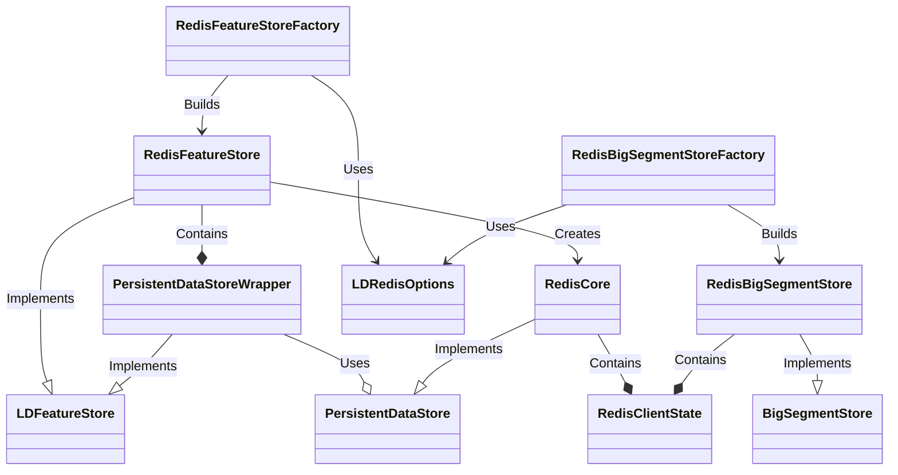

# Architectural Overview

## Components

RedisFeatureStoreFactory: Method which generates a factory which will build RedisFeatureStore instances. This is what is used by the end user in their SDK configuration to configure persistence.

RedisBigSegmentStoreFactory: Method which generates a factory which will build RedisBigSegmentStore instances. This is what is used by the end user in their SDK configuration to configure big segments.

LDRedisOptions: Configuration options passed to the factory to configure a RedisFeatureStore.

RedisFeatureStore: The feature store implements LDFeatureStore, it contains a PersistentDataStoreWrapper
which it marshalls all operations to. The PeristentDataStoreWrapper uses the PersistentDataStore, implemented by the RedisCore, to read and write from persistence. The PersistentDataStoreWrapper contains common operations, such as caching, which should apply to all persistent store implementations.

RedisBigSegmentStore: Implements BigSegmentStore, it contains a RedisClientState which it uses to do redis operations.

RedisCore: Implements persistent data store operations using Redis.

RedisClientState: Manages the Redis connection and exposes the Redis client to the RedisCore/RedisBigSegmentStore.

## Architecture Diagram

